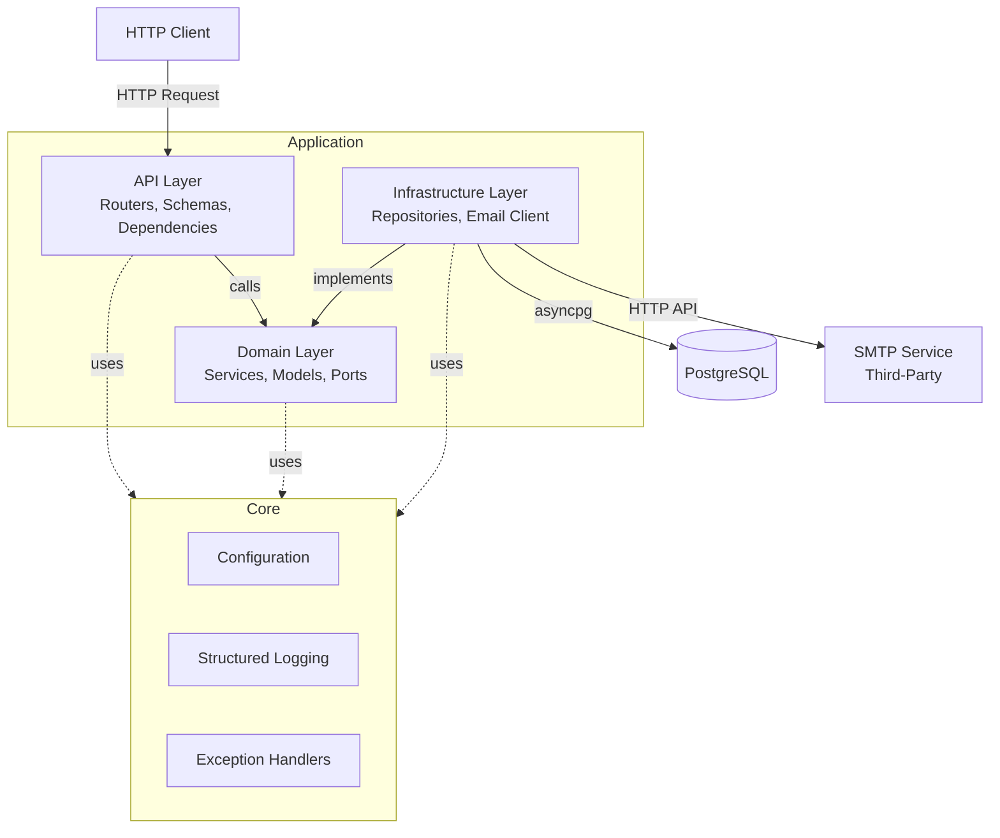
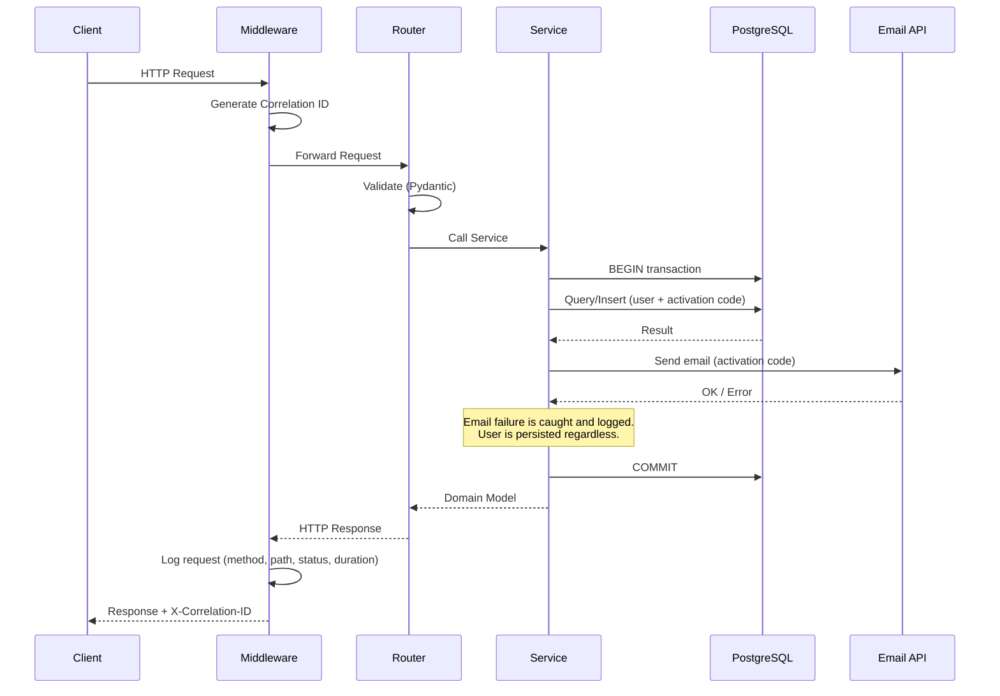

# Architecture

## Overview

This project follows **hexagonal architecture** (ports & adapters) to separate business logic from infrastructure concerns.

## Layers



### API Layer (`src/app/api/`)
- **Inbound adapters**: FastAPI routers, Pydantic request/response schemas
- Handles HTTP concerns: validation, serialization, status codes
- Delegates business logic to domain services via dependency injection

### Domain Layer (`src/app/domain/`)
- **Business rules**: registration, activation, code generation
- **Port interfaces**: abstract classes defining repository and service contracts
- **Models**: domain entities (User, ActivationCode)
- No dependency on infrastructure or framework

### Infrastructure Layer (`src/app/infrastructure/`)
- **Outbound adapters**: concrete implementations of domain ports
- Database repositories (asyncpg, raw SQL — no ORM)
- Email client (third-party SMTP service via HTTP API)

### Core (`src/app/core/`)
- Cross-cutting concerns shared across all layers
- Configuration (Pydantic Settings)
- Structured logging with correlation IDs
- Domain exception definitions and HTTP exception handlers

## Dependency Flow

```
API → Domain ← Infrastructure
```

Dependencies flow **inward**: the API layer and infrastructure layer depend on the domain layer, never the reverse. The domain layer defines port interfaces that infrastructure implements.

## Request Flow



## Database Schema

```sql
users
├── id            UUID (PK, auto-generated)
├── email         VARCHAR(320) UNIQUE NOT NULL
├── password_hash TEXT NOT NULL
├── is_active     BOOLEAN DEFAULT FALSE
├── lang          VARCHAR(5) NOT NULL DEFAULT 'fr'
└── created_at    TIMESTAMPTZ DEFAULT now()

activation_codes
├── id         UUID (PK, auto-generated)
├── user_id    UUID (FK → users.id, CASCADE)
├── code       CHAR(4) NOT NULL
├── expires_at TIMESTAMPTZ NOT NULL
└── used_at    TIMESTAMPTZ (NULL until used)
```

## Database Connection Lifecycle

1. **Startup**: `init_pool()` creates asyncpg connection pool, verifies connectivity with `SELECT 1`
2. **Migrations**: `run_migrations()` applies schema (idempotent `CREATE TABLE IF NOT EXISTS`)
3. **Request**: `get_connection()` yield dependency acquires a connection, starts a transaction, commits on success or rollbacks on error (following FastAPI's yield + try pattern)
4. **Shutdown**: `close_pool()` closes all pool connections

## Email Service

The SMTP server is treated as a **third-party HTTP API** service. Two implementations exist behind the `EmailService` port:

- **`HttpEmailService`**: sends activation codes via HTTP POST to an external SMTP API (`APP_EMAIL_API_URL`), with Bearer token auth
- **`ConsoleEmailService`**: logs activation codes to the console (used when `APP_EMAIL_MOCK=true`)

Email templates are multilingual (fr, en, es, it, de) and loaded from `.txt` files at startup (`infrastructure/email/templates/`). The user's `lang` field determines which template is used.

## External Services

| Service | Role | Connection |
|---------|------|------------|
| PostgreSQL 17 | User and activation code storage | asyncpg connection pool |
| SMTP (third-party) | Send verification emails | HTTP API call (`httpx.AsyncClient`) |
