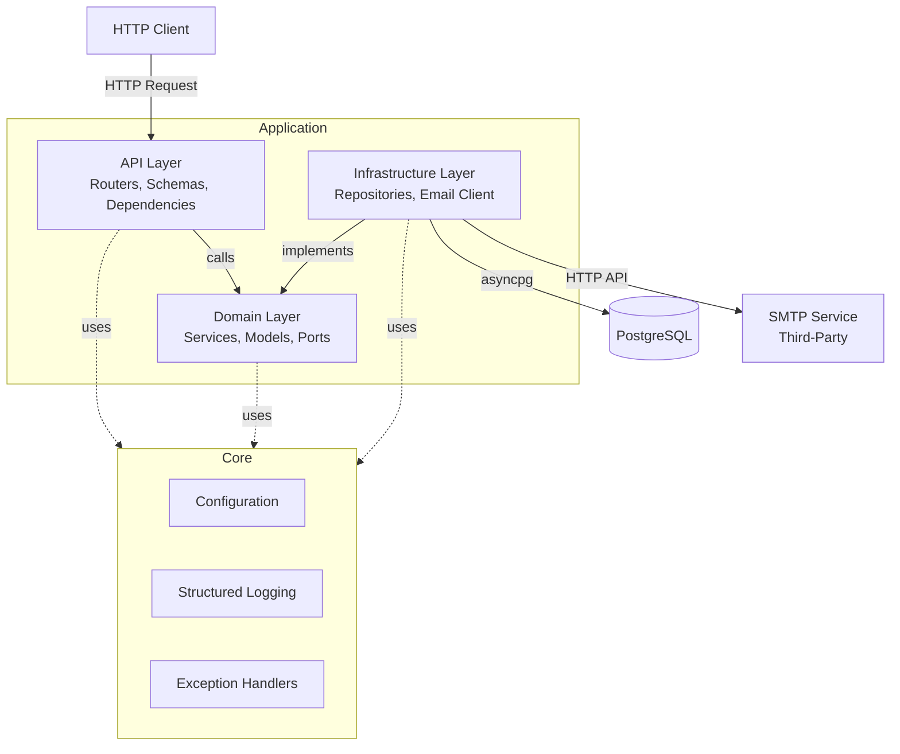
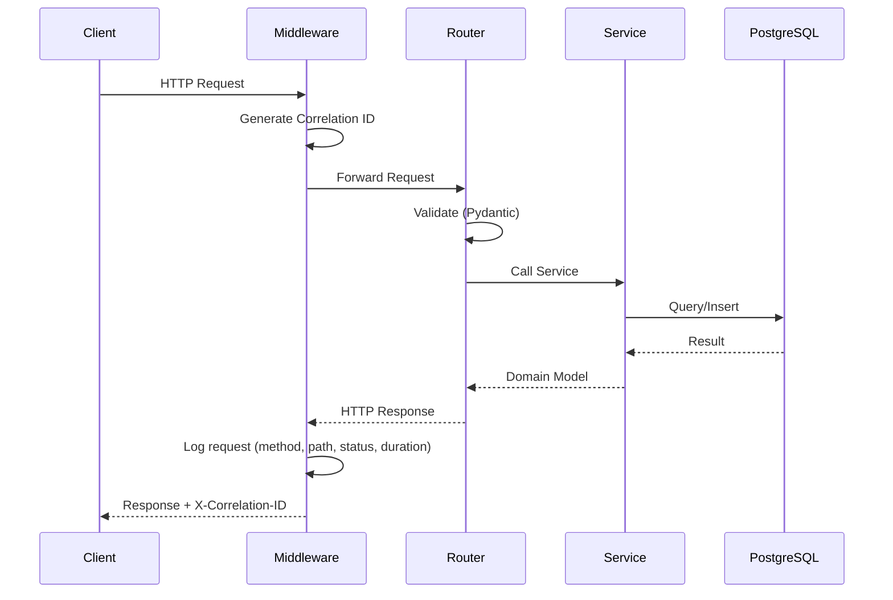

# Architecture

## Overview

This project follows **hexagonal architecture** (ports & adapters) to separate business logic from infrastructure concerns.

## Layers



### API Layer (`src/app/api/`)
- **Inbound adapters**: FastAPI routers, Pydantic request/response schemas
- Handles HTTP concerns: validation, serialization, status codes
- Delegates business logic to domain services via dependency injection

### Domain Layer (`src/app/domain/`)
- **Business rules**: registration, activation, code generation
- **Port interfaces**: abstract classes defining repository and service contracts
- **Models**: domain entities (User, ActivationCode)
- No dependency on infrastructure or framework

### Infrastructure Layer (`src/app/infrastructure/`)
- **Outbound adapters**: concrete implementations of domain ports
- Database repositories (asyncpg, raw SQL — no ORM)
- Email client (third-party SMTP service via HTTP API)

### Core (`src/app/core/`)
- Cross-cutting concerns shared across all layers
- Configuration (Pydantic Settings)
- Structured logging with correlation IDs
- Domain exception definitions and HTTP exception handlers

## Dependency Flow

```
API → Domain ← Infrastructure
```

Dependencies flow **inward**: the API layer and infrastructure layer depend on the domain layer, never the reverse. The domain layer defines port interfaces that infrastructure implements.

## Request Flow



## External Services

| Service | Role | Connection |
|---------|------|------------|
| PostgreSQL 17 | User and activation code storage | asyncpg connection pool |
| SMTP (third-party) | Send verification emails | HTTP API call |
